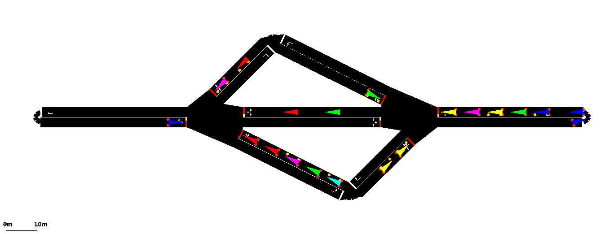

<head>
  <link rel="stylesheet" href="./styles.css">
</head>
<a 
  class="topright"
  href="./graphs.nb.html" 
  title="Next: Creating PNGs of the Direct Graphs">
    NEXT
</a>

# Introduction
The map we will be using for a detailed explaination of the process is a map created for the vehicular traffic simulation software SUMO (**S**imulation of **U**rban **Mo**bility). The map we choose has a small number of nodes and edges, a suitable choice as it allows for concise representation and may be respresented as a directed graph with many nodes and edges which allows us to create ambigous functions we may use to automate the process of SUMO map reduction using clustering. A screenshot of the project `3choices` is shown in Figure 1.
<center>
  
  **Figure 1. - The map of project `3choices` rendered in SUMO.**
</center>

# Visualizing our JSON data.
The directed graph data for the maps used in this projected are stored within the `./jsons` subdirectory with each map's filed stored in `./jsons/<map>`. Within each map directory are two `.json` files. The first is `junctions.json` which contains coordinate data of locations where roads meet at a junction, these are the nodes of our directed graph. The second is `edges.json` which contains coordinates of the start and ending points of roads between two junctions. Each edge within `edges.json` is unidirectional. 

We will use the library `jsonlite` to read our `.json` files.
```{r warning=FALSE}
library(jsonlite)
```

First we read in `junctions.json` from the project `3choices` into a variable called `junctions.list` which is a nested list of six (6) columns and two (2) rows.
```{r}
junctions.list <- fromJSON('../jsons/3choices/junctions.json')
print(
  paste0(
    length(junctions.list),
    " by ",
    length(junctions.list[[1]])
  )
)
```

We then read in `edges.json` from the same project into a variable called `edges.list` which is a nested list of fourteen (14) columns and two (2) rows.
```{r}
edges.list <- fromJSON('../jsons/3choices/edges.json')
print(
  paste0(
    length(edges.list),
    " by ",
    length(edges.list[[1]])
  )
)
```


The data in it's current form is difficult to visualize. We know the following about our `.json` data:

- The data is read in as a nested list.
- The names of Dimension 1 are the IDs of the data.
- The names of Dimension 2 are the attribute descriptions of the data
- The `.json` data is symetrical in that every item's dimension 2 is the same length and type.

With this information, we may create a function to create a matrix from a symmetrical nested list.
```{r}
# Takes a symmetrical nested list and creates a matrix.
# The names of dimension 1 are used as column names and
# the names of dimension 2 are used as row names.
#
# @param somedata.list <- a nested list.
# @return <- a named matrix of the input somedata.list
sym_nested_list_to_matrix <- function(somedata.list){
  # Gather data from our list
  nrows <- length(somedata.list)
  ncols <- length(somedata.list[[1]])
  rnames <- names(somedata.list)
  cnames <- names(somedata.list[[1]])
  
  # Create an empty matrix of lists
  somedata.matrix <- matrix(
    data=rep(list(),nrows*ncols),
    nrow=nrows,
    ncol=ncols,
    byrow=FALSE,
    dimnames=NULL
    )
  
  # Add row and column names
  rownames(somedata.matrix) <- rnames
  colnames(somedata.matrix) <- cnames
  
  # Copy data one cell at a time
  for (row.index in 1:nrows){
    for (col.index in 1:ncols){
      somedata.matrix[row.index,col.index] <- somedata.list[[row.index]][col.index]
    }
  }
  
  return(somedata.matrix)
}
```

Now we can view our new junctions matrix.
```{r}
junctions.matrix <- sym_nested_list_to_matrix(junctions.list)
print(junctions.matrix)
```

And we can also specify which junction and which type of coordinates we want to use.
```{r}
print(junctions.matrix['gneJ5','normal_center_coords'])
```

As we did with our junctions, we also convert our edges list into a matrix.
```{r}
edges.matrix <- sym_nested_list_to_matrix(edges.list)
print(edges.matrix)
```

```{r}
print(edges.matrix['gneJ1_to_gneJ3','normal_coords'])
```

# Compiling directed graphs.

Now that we have imported the contents of `junctions.json` and `edges.json`, the next step is to transform this data into a directed graph by combining the data of junctions.json and edges.json. We will use the `igraph` package.
```{r warning=FALSE}
library(igraph)
```

To create our directed graph, we first need to combine `junctions.matrix` and `edges.matrix` into an adjacenty matrix that we will call `adjacency.matrix`.
```{r}
# Creates an adjacency matrix by combining data from junctions.matrix and edges.matrix
#
# @param matrix jm <- junctions.matrix
# @param matrix em <- edges.matrix
# @return matrix am <- adjacency.matrix
jmem2am <- function(jm,em){
  # Get the size of the ajacentcy matrix
  jm.amt <- length(names(jm[,1]))
  
  # Store the for the rows and columns
  jm.names <- names(jm[,1])
  
  # Initialize an empty matrix
  am <- matrix(
    data=rep(0, jm.amt * jm.amt),
    ncol=jm.amt,
    nrow=jm.amt,
    byrow=FALSE
  )
  
  # Set row and column names
  rownames(am) <- jm.names
  colnames(am) <- jm.names
  
  # Fill the adjacency matrix
  for (i in 1:nrow(em)){
    from <- paste0(em[i,'from'])
    to <- paste0(em[i,'to'])
    row.index <- match(from,rownames(am))
    col.index <- match(to,colnames(am))
    am[row.index,col.index] <- 1
  }
  
  return(am)
}
```

Below we test out our function and recieve the adjacency matrix for the project `3choices`.
```{r}
adjacency.matrix <- jmem2am(jm=junctions.matrix,em=edges.matrix)
print(adjacency.matrix)
```

With an adjacency matrix, we can create a directed graph.
```{r}
adjacency.network <- graph_from_adjacency_matrix(
  adjacency.matrix,
  mode="directed"
)
plot.igraph(
  adjacency.network,
  edge.color="black"
)
```

For comparison, we also create the graph using the `statnet` library.
```{r warning=FALSE}
library(statnet)
```

```{r}
adjacency.network2 <- network(
  adjacency.matrix,
  matrix.type="adjacency",
  directed=FALSE,
  cignore.eval=FALSE,
  names.eval="value"
)
gplot(
  adjacency.network2,
  gmode="digraph",
  label=adjacency.network2%v%'vertex.names',
  arrowhead.cex=1
)
```


