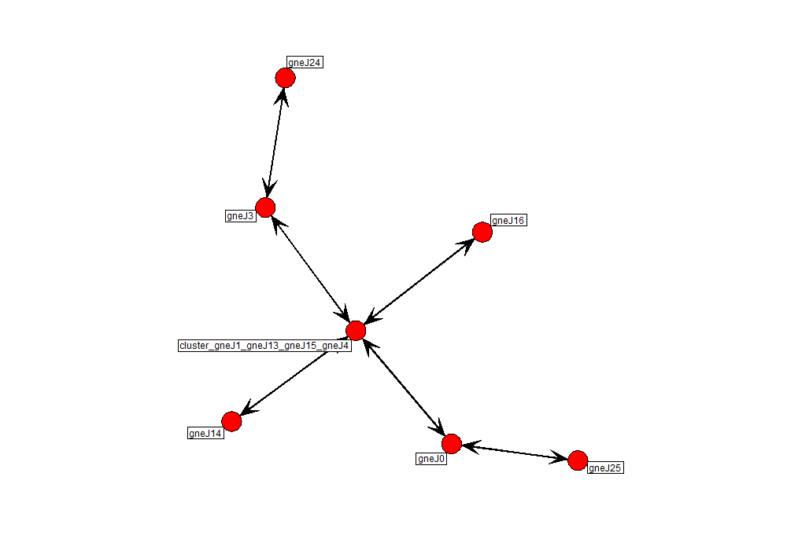

<head>
  <link rel="stylesheet" href="./styles.css">
</head>
<a 
  class="topleft"
  href="./dgmethod.nb.html" 
  title="Previous: Visualizing SUMO mapa data as a directed graph.">
    PREVIOUS
</a>
<a 
  class="topright"
  href="./xyplotmethod.nb.html" 
  title="Next: Plotting Junction XY Coordinates.">
    NEXT
</a>

#Introduction
On this page we have some code as well as images which is used to create high-quality PNGs of the directed graphs for every project within the `jsons` directory. We have taken the code from the example using `3choices` on the
<a
 href="./dgmethod.nb.html"
 title="Previous: Visualizing SUMO mapa data as a directed graph.">
 previous page
</a>
and made it ambiguous and modular in the script `sumo_dg_viewer.R`. We start by including the source file `sumo_dg_viewer.R`. An additional note, we decide that the `statnet` graphs are visually cleaner than the `igraph` graphs and so all of the PNGs produced are `statnet` graphs.

```{r message=FALSE}
source(file="../scripts/sumo_dg_viewer.R")
```

##3choices
```{r}
# 3choices
png(file="../exports/directed_graphs/3choices.dg.png",width=1000,height=500,units="px",res=NA)
adjacency.matrix.3choices <- json2am('3choices') 

adjacency.network.3choices <- network(
  adjacency.matrix.3choices,
  matrix.type="adjacency",
  directed=FALSE,
  cignore.eval=FALSE,
  names.eval="value"
)
gplot(
  adjacency.network.3choices,
  gmode="digraph",
  label=adjacency.network.3choices%v%'vertex.names',
  boxed.labels=TRUE,
  vertex.cex=1.5,
  arrowhead.cex=1.5
)
```


##Davenport
```{r}
# Davenport
png(file="../exports/directed_graphs/Davenport.dg.png",width=10000,height=7000,units="px",res=NA)

if (!exists("adjacency.matrix.Davenport")){
  adjacency.matrix.Davenport <- json2am('Davenport')
}
  
adjacency.network.Davenport <- network(
  adjacency.matrix.Davenport,
  matrix.type="adjacency",
  directed=FALSE,
  cignore.eval=FALSE,
  names.eval="value"
)
gplot(
  adjacency.network.Davenport,
  gmode="digraph",
  label=adjacency.network.Davenport%v%'vertex.names',
  boxed.labels=TRUE,
  vertex.cex=0.3,
  arrowhead.cex=0.3
)
```


##flpoly
```{r}
# flpoly
png(file="../exports/directed_graphs/flpoly.dg.png",width=3000,height=3600,units="px",res=NA)
adjacency.matrix.flpoly <- json2am('flpoly')

adjacency.network.flpoly <- network(
  adjacency.matrix.flpoly,
  matrix.type="adjacency",
  directed=FALSE,
  cignore.eval=FALSE,
  names.eval="value"
)
gplot(
  adjacency.network.flpoly,
  gmode="digraph",
  label=adjacency.network.flpoly%v%'vertex.names',
  boxed.labels=TRUE,
  vertex.cex=0.3,
  arrowhead.cex=0.3
)
```


##grid2
```{r}
# grid2
png(file="../exports/directed_graphs/grid2.dg.png",width=1000,height=700,units="px",res=NA)
adjacency.matrix.grid2 <- json2am('grid2')

adjacency.network.grid2 <- network(
  adjacency.matrix.grid2,
  matrix.type="adjacency",
  directed=FALSE,
  cignore.eval=FALSE,
  names.eval="value"
)
gplot(
  adjacency.network.grid2,
  gmode="digraph",
  label=adjacency.network.grid2%v%'vertex.names',
  boxed.labels=TRUE,
  vertex.cex=1,
  arrowhead.cex=1
)
```


##Haines_City
```{r}
# Haines_City
png(file="../exports/directed_graphs/Haines_City.dg.png",width=10000,height=7000,units="px",res=NA)

if (!exists("adjacency.matrix.Haines_City")){
  adjacency.matrix.Haines_City <- json2am('Haines_City')
}
  
adjacency.network.Haines_City <- network(
  adjacency.matrix.Haines_City,
  matrix.type="adjacency",
  directed=FALSE,
  cignore.eval=FALSE,
  names.eval="value"
)
gplot(
  adjacency.network.Haines_City,
  gmode="digraph",
  label=adjacency.network.Haines_City%v%'vertex.names',
  boxed.labels=TRUE,
  vertex.cex=0.3,
  arrowhead.cex=0.3
)
```


##intersection_1
```{r}
# intersection_1
png(file="../exports/directed_graphs/intersection_1.dg.png",width=1000,height=700,units="px",res=NA)
adjacency.matrix.intersection_1 <- json2am('intersection_1')

adjacency.network.intersection_1 <- network(
  adjacency.matrix.intersection_1,
  matrix.type="adjacency",
  directed=FALSE,
  cignore.eval=FALSE,
  names.eval="value"
)
gplot(
  adjacency.network.intersection_1,
  gmode="digraph",
  label=adjacency.network.intersection_1%v%'vertex.names',
  boxed.labels=TRUE,
  vertex.cex=1,
  arrowhead.cex=1
)
```


##leopard
```{r}
# leopard
png(file="../exports/directed_graphs/leopard.dg.png",width=3000,height=3600,units="px",res=NA)
adjacency.matrix.leopard <- json2am('leopard')

adjacency.network.leopard <- network(
  adjacency.matrix.leopard,
  matrix.type="adjacency",
  directed=FALSE,
  cignore.eval=FALSE,
  names.eval="value"
)
gplot(
  adjacency.network.leopard,
  gmode="digraph",
  label=adjacency.network.leopard%v%'vertex.names',
  boxed.labels=TRUE,
  vertex.cex=0.3,
  arrowhead.cex=0.3
)
```

