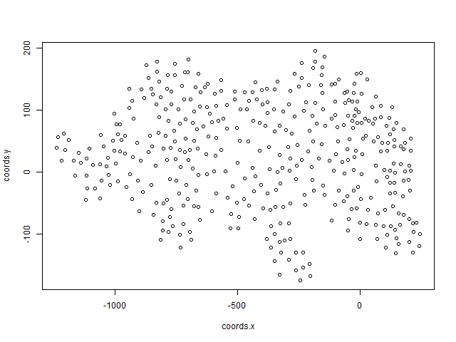

<head>
  <link rel="stylesheet" href="./styles.css">
</head>
<a 
  class="topleft"
  href="./xyplot.pngs.nb.html" 
  title="Previous: Creating PNGs using junctions as points">
    PREVIOUS
</a>
<a 
  class="topright"
  href="./kmeansplots.nb.html" 
  title="Next: Creating PNGs of all k-means clustered projects.">
    NEXT
</a>

#Introduction
On this page we will perform k-means clustering on a SUMO map by using the junctions as points with `x` and `y` coordinates. For the following examples we will project `leopard` which has many points and when plotted, none of the points overlap any other points. Additionally, the project `leopard` was created using the SUMO tool NETEDIT and as such, the names of the junctions are short (i.e. `gneJ115`) whereas in a project important from OpenSteetMaps such as `Davenport`, the names of the junctions may be very long. A preview of the `leopard` junctions plotted by their `x` and `y` coordinates is shown in Figure 1.
<center>
  <br/>
  **Figure 1** -- The junctions of project`leopard`plotted by the `x` and `y` coordinates of it's junctions.
</center>
We will use the script `SUMO.project2plot.R` to retrieve the `true_center_coords` `x` and `y` coordinates and junction names from `junctions.json` in project `leopard`. We being by importing the script `SUMO.project2plot.R`.
```{r message=FALSE}
source(file='../scripts/SUMO.project2plot.R')
```

Before we can perform k-means clustering on our data we must structure the data to work with the built in R function `kmeans`. To start, we retrieve the `x`, `y` and `names` of our junctions by extracting the data from the `.json` file for the project `leopard` in the `jsons` directory.
```{r message=FALSE}
# Get a junctions.matrix from the json files for project `leopard`
junctions.matrix <- project.name2jm('leopard')

# Extract the data we want from junction.data at column 'True Coords' (default)
xynames <- jm2xynames(junctions.matrix)

# Summarize our object `xynames`
print(summary(xynames))

# Unlist and give x, y, and names their own vectors.
coords.x <- unlist(xynames[1])
coords.y <- unlist(xynames[2])
coords.names <- unlist(xynames[3])

# Clean up
rm(junctions.matrix,xynames)
```

Next, we combine the coordinate data into a format readable by the `kmeans` function.
```{r}
coords.matrix <- cbind(coords.x,coords.y)
colnames(coords.matrix) <- c('x','y')
rownames(coords.matrix) <- coords.names
print(head(coords.matrix,n=10L))
```

Then we use the built in `kmeans` function to find some clusters.
```{r}
ncenters <- 6
coords.clusters <- kmeans(
  x = coords.matrix,
  centers = ncenters,
  iter.max = 50,
  nstart = 27,
  algorithm = 'Hartigan-Wong'
)
print(coords.clusters)
```

Finally, we view the plot of our `kmeans` clustered junction data.
```{r}
plot(x = coords.matrix, col = coords.clusters$cluster)
points(coords.clusters$centers, col = 1:ncenters , pch = 8, cex = 2)
```


