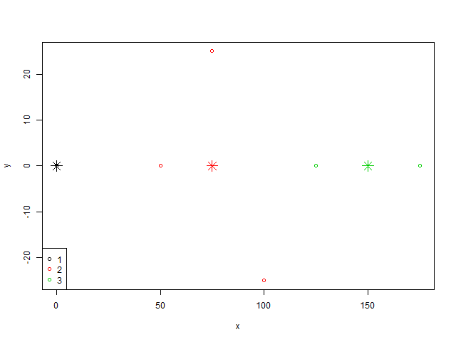
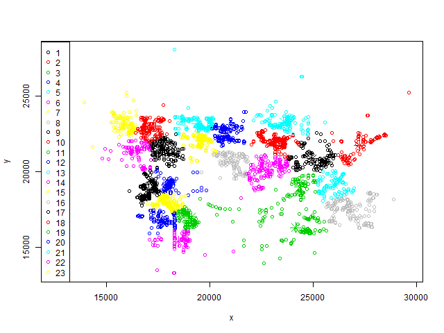
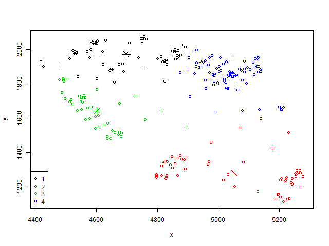
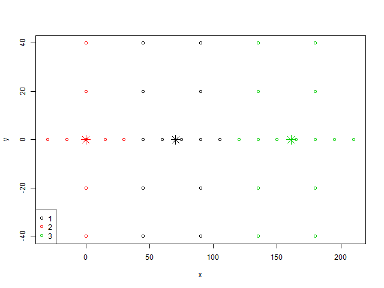
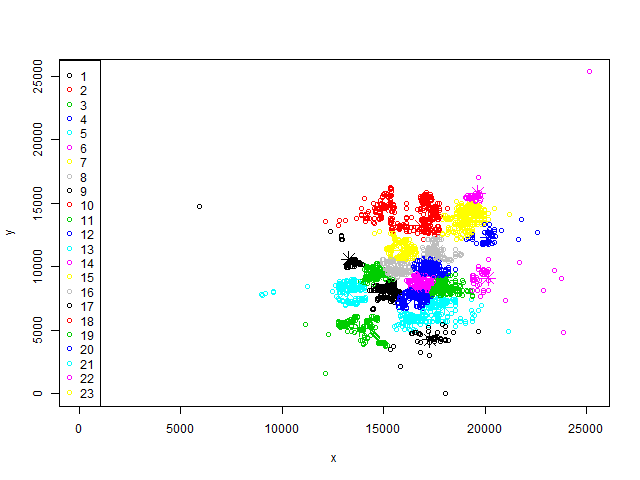
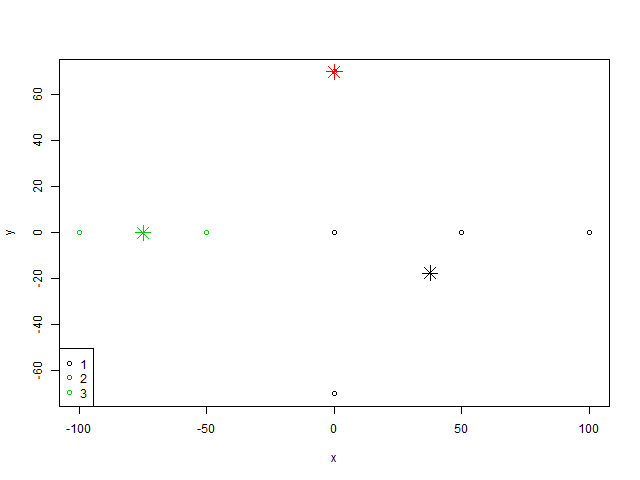
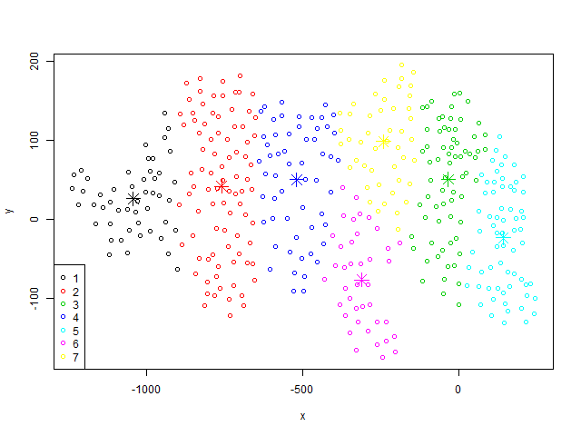

<head>
  <link rel="stylesheet" href="./styles.css">
</head>
<a 
  class="topleft"
  href="./kmeansmethod.nb.html" 
  title="Previous: K-means clustering of junctions coordinates.">
    PREVIOUS
</a>
<a 
  class="topright"
  href="./findneighborsmethod.nb.html" 
  title="Next: Find connections between clusters.">
    NEXT
</a>


# Introduction
On this page we will create PNGs for each of the projects in the `jsons` directory when the base `kmeans` method is applied and the value for `k` is given rather than determined by an algorithm. We have adapted the process and code found on the
<a
 href="./kmeansmethod.nb.html"
 title="Previous: K-means clustering of junctions coordinates.">
 previous page
</a>
and made it abiguous and module in the script `clusterSUMO.project.R`.

```{r message=FALSE}
source(file='../scripts/clusterSUMO.project.R')
```


# 3choices
```{r message=FALSE}
png(file='../exports/kmeans_ks/3choices.kmeans.ks.png',width=640,height=480,units='px')
plot.kmeans(project.name2cm('3choices'),k=3)
```
<center></center>

# Davenport
```{r message=FALSE}
png(file='../exports/kmeans_ks/Davenport.kmeans.ks.png',width=640,height=480,units='px')
plot.kmeans(project.name2cm('Davenport'),k=23)
```
<center></center>

# flpoly
```{r message=FALSE}
png(file='../exports/kmeans_ks/flpoly.kmeans.ks.png',width=640,height=480,units='px')
plot.kmeans(project.name2cm('flpoly'),k=4)
```
<center></center>

# grid2
```{r message=FALSE}
png(file='../exports/kmeans_ks/grid2.kmeans.ks.png',width=640,height=480,units='px')
plot.kmeans(project.name2cm('grid2'),k=3)
```
<center></center>

# Haines_City
```{r message=FALSE}
png(file='../exports/kmeans_ks/Haines_City.kmeans.ks.png',width=640,height=480,units='px')
plot.kmeans(project.name2cm('Haines_City'),k=23)
```
<center></center>

# intersection_1
```{r message=FALSE}
png(file='../exports/kmeans_ks/intersection_1.kmeans.ks.png',width=640,height=480,units='px')
plot.kmeans(project.name2cm('intersection_1'),k=3)
```
<center></center>

# leopard
```{r message=FALSE}
png(file='../exports/kmeans_ks/leopard.kmeans.ks.png',width=640,height=480,units='px')
plot.kmeans(project.name2cm('leopard'),k=7)
```
<center></center>