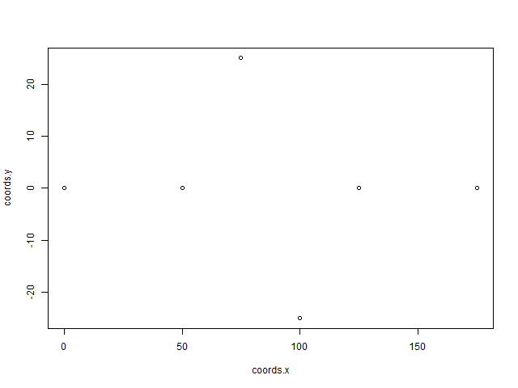
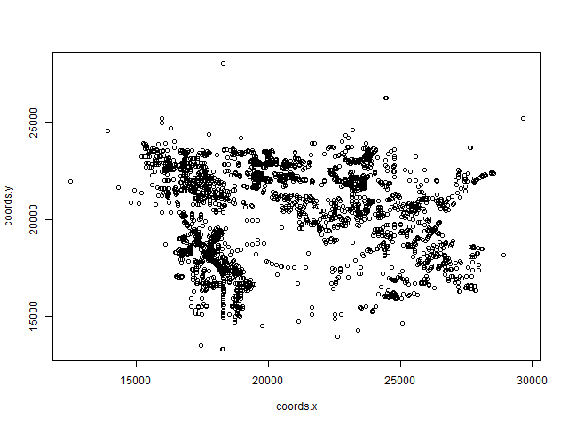
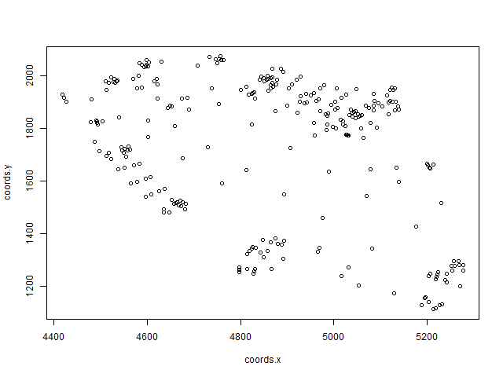
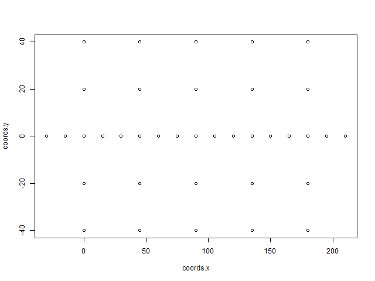
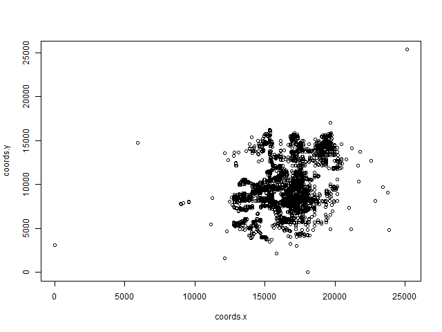
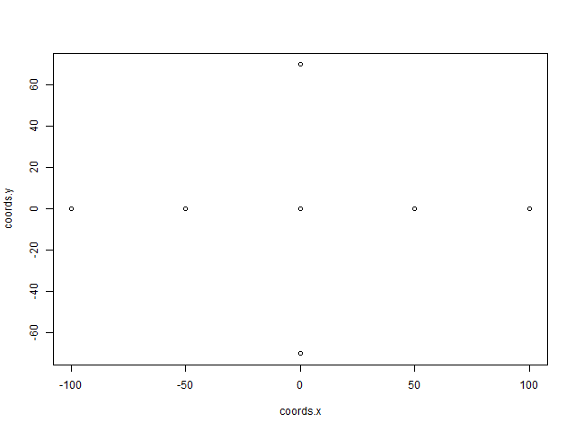
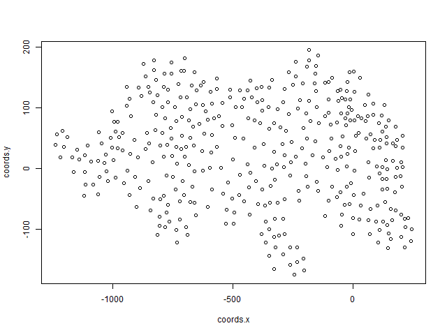

<head>
  <link rel="stylesheet" href="./styles.css">
</head>
<a 
  class="topleft"
  href="./xyplotmethod.nb.html" 
  title="Previous: Plotting Junction XY Coordinates.">
    PREVIOUS
</a>
<a 
  class="topright"
  href="./kmeansmethod.nb.html" 
  title="Next: K-means clustering of junctions coordinates.">
    NEXT
</a>

# Introduction
On this page we have some code as well as images used to create high-quality PNGs for every project within the `jsons` directory. We have adapted the process and code found on the
<a
 href="./kmeansmethod.nb.html"
 title="Previous: Plotting Junction XY Coordinates.">
 previous page
</a>
and made it abiguous and module in the script `SUMO.project2plot.R`. We begin by including the source file `SUMO.project2plot.R`, that will handle the creation of an a plot of junctions in a specified SUMO project.
```{r message=FALSE}
source(file='../scripts/SUMO.project2plot.R')
```

##3choices
```{r message=FALSE}
png(file="../exports/xyplots/3choices.xyplot.png",width=640,height=480,units="px",res=NA)
SUMO.project2plot('3choices')
```
<center></center>

##Davenport
```{r message=FALSE}
png(file="../exports/xyplots/Davenport.xyplot.png",width=640,height=480,units="px",res=NA)
SUMO.project2plot('Davenport')
```
<center></center>

##flpoly
```{r message=FALSE}
png(file="../exports/xyplots/flpoly.xyplot.png",width=640,height=480,units="px",res=NA)
SUMO.project2plot('flpoly')
```
<center></center>

##grid2
```{r message=FALSE}
png(file="../exports/xyplots/grid2.xyplot.png",width=640,height=480,units="px",res=NA)
SUMO.project2plot('grid2')
```
<center></center>

##Haines_City
```{r message=FALSE}
png(file="../exports/xyplots/Haines_City.xyplot.png",width=640,height=480,units="px",res=NA)
SUMO.project2plot('Haines_City')
```
<center></center>

##intersection_1
```{r message=FALSE}
png(file="../exports/xyplots/intersection_1.xyplot.png",width=640,height=480,units="px",res=NA)
SUMO.project2plot('intersection_1')
```
<center></center>

##leopard
```{r message=FALSE}
png(file="../exports/xyplots/leopard.xyplot.png",width=640,height=480,units="px",res=NA)
SUMO.project2plot('leopard')
```
<center></center>